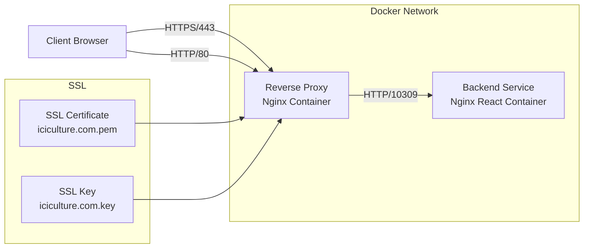
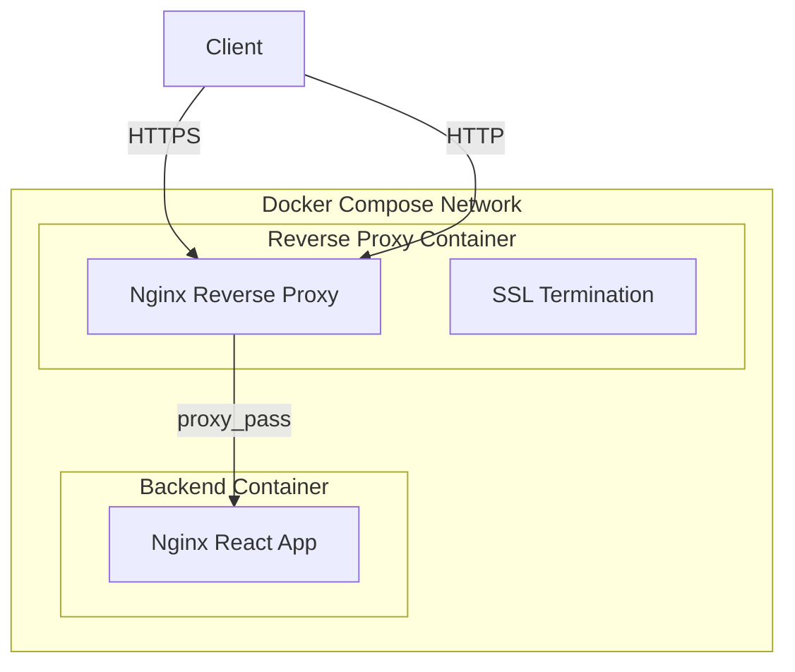
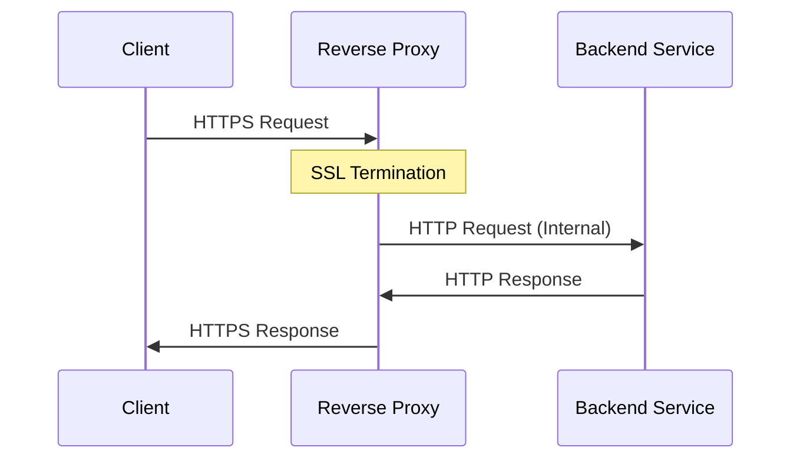

# Reverse Proxy Deployment Solution for Tencent Cloud Lightweight Server

This project provides an automated reverse proxy deployment solution based on Ubuntu 24.04 and Docker.

## Architecture Overview

### System Architecture


### Container Network Architecture


### SSL Configuration Flow


## Key Features

1. **SSL Termination**
   - Handles HTTPS connections from clients
   - Uses SSL certificates for secure communication
   - Forwards requests internally over HTTP

2. **Load Balancing**
   - Distributes incoming traffic
   - Health checks for backend services
   - Automatic failover capabilities

3. **Security Features**
   - TLS 1.2/1.3 support
   - Strong cipher configurations
   - HTTP/2 support
   - Security headers

4. **Performance Optimization**
   - Static file caching
   - Compression for text-based content
   - Connection pooling
   - WebSocket support

## Requirements

- Ubuntu 24.04
- Docker 24.0+
- Docker Compose Plugin 2.20.0+

## System Requirements

### Ubuntu 24.04 System Configuration

1. Update system packages:
```bash
sudo apt update
sudo apt upgrade -y
```

2. Install Docker:
```bash
sudo apt install -y docker.io
sudo systemctl enable docker
sudo systemctl start docker
sudo usermod -aG docker $USER
```

3. Install Docker Compose Plugin:
```bash
sudo apt install -y docker-compose-plugin
```

Note: You need to log out and back in after adding your user to the docker group.

## Directory Structure

```
.
├── docker-compose.yml    # Docker Compose configuration file
├── nginx/               # Nginx configuration directory
│   ├── conf.d/         # Nginx site configurations
│   └── nginx.conf      # Nginx main configuration file
├── scripts/            # Deployment scripts
│   └── deploy.sh      # Automated deployment script
└── README.md          # Project documentation
```

## Quick Start

1. Clone the project to your server:
```bash
git clone [project-url]
cd reverse_proxy_deploy
```

2. Run the deployment script:
```bash
bash scripts/deploy.sh
```

3. Configure reverse proxy:
Edit the `nginx/conf.d/default.conf` file to add your reverse proxy configuration.

4. Restart the service:
```bash
docker compose restart nginx
```

## Configuration Guide

### Nginx Configuration

Nginx configuration files are located in the `nginx/conf.d/` directory. You can modify or add new configuration files as needed.

### Docker Configuration

Docker-related configurations are in the `docker-compose.yml` file, including:
- Container names
- Port mappings
- Volume mounts
- Network settings

## Maintenance Guide

- Check service status: `docker compose ps`
- View service logs: `docker compose logs -f nginx`
- Restart service: `docker compose restart nginx`
- Stop service: `docker compose down` 